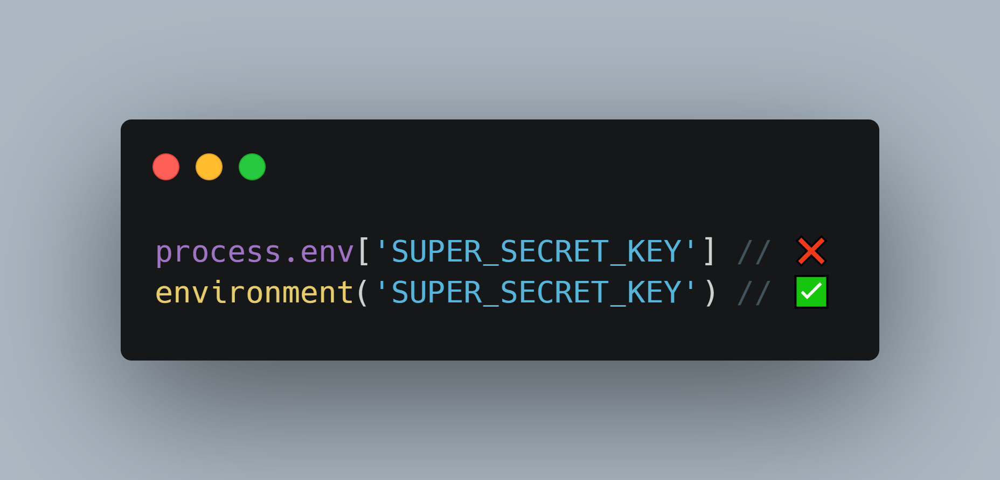

# Obelisq 🔺

Load environment variables from `.env` into `NodeJS.ProcessEnv`.



## Install

```ts
pnpm add obelisq
```

## Usage

Create a `.env` file in the root directory of your project, e.g.:

```sh
SUPER_SECRET_KEY=your_secret_key
API_VERSION=2
```

In the entrypoint to your app (e.g. `index.ts`), call `setup` to load your `.env` into Node's `process.env`:

```ts
// index.ts
import { setup } from "obelisq";

// Takes additional, optional configuration.
// Returns a list of entries (`TEnvironmentLineKeyValue`) which may be used for e.g. validation purposes.
await setup();
```

You can also run `$ obelisq <script>` to load the environment variables into `process.env` for another Node script. Say you have a file `log-env.js` which simply executes `console.log(process.env)`. You can inject the values from your environment file into `process.env` by running the following command:

```sh
obelisq node log-env.js
```

The output should contain:

```sh
$ obelisq node log-env.js

{
  // ...
  SUPER_SECRET_KEY: 'your_secret_key',
  API_VERSION: '2'
}
```

## Type-safety

You can generate a library which provides minimal type-safety when accessing the environment variables.

```sh
obelisq generate [-o <string>]
```

This will output `obelisq.ts` (unless specified differently with `-o` — "output path") which exports `environment`, a function which takes a single argument of type `TObelisqEnvironmentKeys`. What is `TObelisqEnvironmentKeys`? It's a type that extends a `Record` where the `keys` are the keys of your environment file and the values are the (assumed) type of the value, e.g.:

```ts
type TObelisqEnvironmentKeys = {
  SUPER_SECRET_KEY: string;
  API_VERSION: number;
};
```

## Variable expansion

Variable expansion works out of the box without any additional packages or configuration steps. If your environment looks like this:

```sh
SUPER_SECRET_KEY=your_secret_key
API_VERSION=2${SUPER_SECRET_KEY}
```

Running `$ obelisq` will add the following to `process.env`:

```ts
SUPER_SECRET_KEY: 'your_secret_key',
API_VERSION: '2your_secret_key'
```

Note that it's advisable to run `$ obelisq generate` every time you change your `.env` as expansion may change the value's assumed type.
